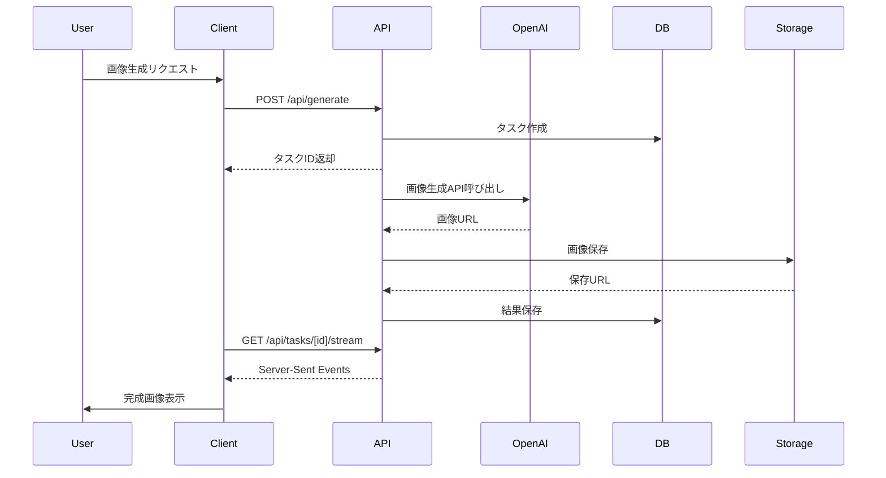
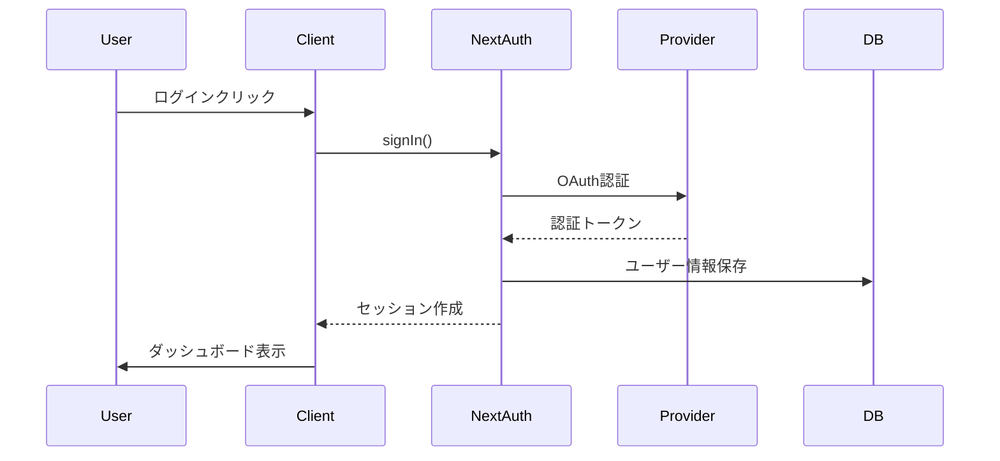

# ビックリマンシール風画像生成ツール アーキテクチャ設計書

## 概要
Next.js 14 (App Router)、Tailwind CSS、SQLiteを使用したフルスタックWebアプリケーションのアーキテクチャ設計書です。

## システム構成図

```
┌─────────────────┐     ┌─────────────────┐
│   Next.js App   │────▶│  OpenAI API     │
│  (Full Stack)   │     │  (GPT-4o)       │
└─────────────────┘     └─────────────────┘
        │
        ▼
┌─────────────────┐
│   Database      │
│   (SQLite)      │
└─────────────────┘
```

## 技術スタック

### フレームワーク・ライブラリ
- **Next.js 14.x**: App Routerを使用したフルスタックフレームワーク
- **TypeScript**: 型安全な開発
- **Tailwind CSS**: ユーティリティファーストのCSSフレームワーク
- **Prisma**: 型安全なORMでSQLiteと連携
- **NextAuth.js**: 認証・認可
- **React Hook Form**: フォーム管理
- **Zod**: バリデーション

### データベース
- **SQLite**: ローカルファイルベースのデータベース
- **Prisma ORM**: データベース操作の抽象化

### 画像処理・ストレージ
- **Canvas API**: クライアントサイドでの画像後処理
- **Vercel Blob**: 画像ファイルストレージ
- **Sharp**: サーバーサイドでの画像最適化

### インフラ・デプロイ
- **Vercel**: ホスティング・デプロイ
- **Vercel Edge Network**: CDN
- **GitHub Actions**: CI/CD

## ディレクトリ構造

```
bikkuriman-sticker-creator/
├── app/                        # Next.js App Router
│   ├── layout.tsx             # ルートレイアウト
│   ├── page.tsx               # ホームページ
│   ├── globals.css            # グローバルスタイル
│   ├── generate/              # 画像生成ページ
│   │   └── page.tsx
│   ├── history/               # 履歴ページ
│   │   └── page.tsx
│   ├── api/                   # API Routes
│   │   ├── auth/[...nextauth]/
│   │   │   └── route.ts       # NextAuth.js
│   │   ├── generate/
│   │   │   └── route.ts       # 画像生成API
│   │   ├── upload/
│   │   │   └── route.ts       # アップロードAPI
│   │   └── history/
│   │       └── route.ts       # 履歴API
│   └── (auth)/                # 認証関連ページ
│       ├── login/
│       └── register/
├── components/                 # UIコンポーネント
│   ├── generator/             # 画像生成関連
│   ├── preview/               # プレビュー関連
│   ├── gallery/               # ギャラリー関連
│   └── ui/                    # 共通UI
├── lib/                       # ライブラリ・ユーティリティ
│   ├── api.ts                # APIクライアント
│   ├── auth.ts               # NextAuth設定
│   ├── db.ts                 # Prismaクライアント
│   ├── openai.ts             # OpenAI API
│   └── actions.ts            # Server Actions
├── hooks/                     # カスタムフック
├── utils/                     # ユーティリティ関数
├── types/                     # TypeScript型定義
├── prisma/                    # Prismaスキーマ
│   ├── schema.prisma
│   └── migrations/
├── public/                    # 静的ファイル
└── tests/                     # テストファイル
```

## データフロー

### 1. 画像生成フロー



### 2. 認証フロー



## コンポーネント設計

### 1. Server Components vs Client Components

#### Server Components（デフォルト）
- データフェッチ
- 静的コンテンツ
- SEO重要なコンテンツ

```tsx
// app/history/page.tsx
export default async function HistoryPage() {
  const images = await getGeneratedImages();
  return <HistoryGrid images={images} />;
}
```

#### Client Components
- インタラクティブUI
- ブラウザAPI使用
- リアルタイム更新

```tsx
// components/generator/prompt-input.tsx
'use client';

export function PromptInput() {
  const [value, setValue] = useState('');
  // インタラクティブな処理
}
```

### 2. Server Actions

```typescript
// lib/actions.ts
'use server';

export async function generateImageAction(formData: FormData) {
  const session = await getServerSession();
  if (!session) throw new Error('Unauthorized');
  
  const result = await prisma.task.create({
    data: {
      userId: session.user.id,
      status: 'pending',
      data: JSON.stringify(Object.fromEntries(formData))
    }
  });
  
  // バックグラウンド処理開始
  processImageGeneration(result.id);
  
  return { taskId: result.id };
}
```

## 状態管理

### 1. ローカル状態
- React useState/useReducer
- フォーム状態など

### 2. サーバー状態
- Server Components
- キャッシュ機能

### 3. グローバル状態
- React Context（必要最小限）
- URL状態（searchParams）

## パフォーマンス最適化

### 1. 画像最適化
```tsx
import Image from 'next/image';

<Image
  src={imageUrl}
  alt="Generated sticker"
  width={1024}
  height={1024}
  loading="lazy"
  placeholder="blur"
/>
```

### 2. データキャッシュ
```typescript
// Next.jsのキャッシュ機能
import { unstable_cache } from 'next/cache';

const getCachedImages = unstable_cache(
  async (userId: string) => {
    return prisma.generatedImage.findMany({
      where: { userId },
      orderBy: { createdAt: 'desc' }
    });
  },
  ['user-images'],
  { revalidate: 60 } // 60秒キャッシュ
);
```

### 3. Partial Prerendering
```tsx
// app/generate/page.tsx
import { Suspense } from 'react';

export default function GeneratePage() {
  return (
    <>
      <StaticHeader />
      <Suspense fallback={<LoadingSkeleton />}>
        <DynamicContent />
      </Suspense>
    </>
  );
}
```

## セキュリティ

### 1. 認証・認可
- NextAuth.jsによるセッション管理
- API Routesでのセッションチェック

### 2. 入力検証
```typescript
import { z } from 'zod';

const generateSchema = z.object({
  prompt: z.string().min(1).max(500),
  title: z.string().min(1).max(100),
  rarity: z.enum(['normal', 'rare', 'super-rare']),
  // ...
});
```

### 3. レート制限
```typescript
// middleware.ts
import { Ratelimit } from '@upstash/ratelimit';

export async function middleware(request: NextRequest) {
  const ip = request.ip ?? '127.0.0.1';
  const { success } = await ratelimit.limit(ip);
  
  if (!success) {
    return new Response('Too Many Requests', { status: 429 });
  }
}
```

## エラーハンドリング

### 1. Error Boundaries
```tsx
// app/error.tsx
'use client';

export default function Error({
  error,
  reset,
}: {
  error: Error;
  reset: () => void;
}) {
  return (
    <div>
      <h2>エラーが発生しました</h2>
      <button onClick={reset}>再試行</button>
    </div>
  );
}
```

### 2. API エラーハンドリング
```typescript
// app/api/generate/route.ts
export async function POST(request: NextRequest) {
  try {
    // 処理
  } catch (error) {
    if (error instanceof ValidationError) {
      return NextResponse.json(
        { error: error.message },
        { status: 400 }
      );
    }
    
    return NextResponse.json(
      { error: 'Internal Server Error' },
      { status: 500 }
    );
  }
}
```

## テスト戦略

### 1. 単体テスト
- Jest + React Testing Library
- コンポーネントテスト
- ユーティリティ関数テスト

### 2. 統合テスト
- Playwright
- E2Eテスト
- API統合テスト

### 3. パフォーマンステスト
- Lighthouse CI
- Core Web Vitals監視

## デプロイメント

### 1. 環境変数
```env
# 本番環境
OPENAI_API_KEY=
NEXTAUTH_SECRET=
NEXTAUTH_URL=
DATABASE_URL=file:./prod.db
VERCEL_BLOB_READ_WRITE_TOKEN=
```

### 2. ビルド・デプロイ
```bash
# ビルド
npm run build

# 型チェック
npm run type-check

# リント
npm run lint

# Vercelデプロイ
vercel --prod
```

### 3. データベースマイグレーション
```bash
# 本番環境へのマイグレーション
npx prisma migrate deploy
```

## モニタリング

### 1. パフォーマンス監視
- Vercel Analytics
- Sentry Performance

### 2. エラー監視
- Sentry Error Tracking
- カスタムエラーログ

### 3. 使用量監視
- API使用量
- ストレージ使用量
- データベースクエリ数