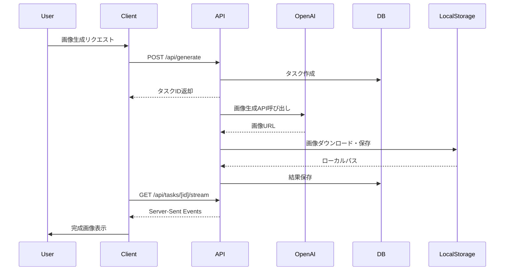

# ビックリマンシール風画像生成ツール アーキテクチャ設計書

## 概要
Next.js 14 (App Router)、Tailwind CSS、SQLiteを使用したローカル環境向けのシンプルなフルスタックWebアプリケーションのアーキテクチャ設計書です。

## システム構成図

```
┌─────────────────┐     ┌─────────────────┐
│   Next.js App   │────▶│  OpenAI API     │
│  (Full Stack)   │     │  (DALL-E 3)     │
└─────────────────┘     └─────────────────┘
        │
        ├───────┐
        ▼       ▼
┌─────────────────┐  ┌─────────────────┐
│   Database      │  │  Local Storage  │
│   (SQLite)      │  │  (public/images)│
└─────────────────┘  └─────────────────┘
```

## 技術スタック

### フレームワーク・ライブラリ
- **Next.js 14.x**: App Routerを使用したフルスタックフレームワーク
- **TypeScript**: 型安全な開発
- **Tailwind CSS**: ユーティリティファーストのCSSフレームワーク
- **Prisma**: 型安全なORMでSQLiteと連携

### データベース・ストレージ
- **SQLite**: ローカルファイルベースのデータベース
- **ローカルファイルシステム**: 生成画像の保存（public/images）

## ディレクトリ構造

```
bikkuriman-sticker-creator/
├── app/                        # Next.js App Router
│   ├── layout.tsx             # ルートレイアウト
│   ├── page.tsx               # ホームページ
│   ├── globals.css            # グローバルスタイル
│   ├── generate/              # 画像生成ページ
│   │   └── page.tsx
│   ├── history/               # 履歴ページ
│   │   └── page.tsx
│   └── api/                   # API Routes
│       ├── generate/
│       │   └── route.ts       # 画像生成API
│       ├── upload/
│       │   └── route.ts       # アップロードAPI
│       ├── history/
│       │   └── route.ts       # 履歴API
│       └── tasks/[taskId]/
│           └── stream/
│               └── route.ts   # タスク進捗ストリーミング
├── components/                 # UIコンポーネント
│   ├── generator/             # 画像生成関連
│   ├── preview/               # プレビュー関連
│   ├── gallery/               # ギャラリー関連
│   └── ui/                    # 共通UI
├── lib/                       # ライブラリ・ユーティリティ
│   ├── api.ts                # APIクライアント
│   ├── db.ts                 # Prismaクライアント
│   ├── openai.ts             # OpenAI API
│   ├── storage.ts            # ローカルストレージ管理
│   └── actions.ts            # Server Actions
├── hooks/                     # カスタムフック
├── utils/                     # ユーティリティ関数
├── types/                     # TypeScript型定義
├── prisma/                    # Prismaスキーマ
│   ├── schema.prisma
│   └── migrations/
└── public/                    # 静的ファイル
    └── images/                # 生成画像保存ディレクトリ
```

## データフロー

### 画像生成フロー



## コンポーネント設計

### 1. Server Components vs Client Components

#### Server Components（デフォルト）
- データフェッチ
- 静的コンテンツ
- SEO重要なコンテンツ

```tsx
// app/history/page.tsx
export default async function HistoryPage() {
  const images = await prisma.generatedImage.findMany({
    orderBy: { createdAt: 'desc' }
  });
  return <HistoryGrid images={images} />;
}
```

#### Client Components
- インタラクティブUI
- ブラウザAPI使用
- リアルタイム更新

```tsx
// components/generator/prompt-input.tsx
'use client';

export function PromptInput() {
  const [value, setValue] = useState('');
  // インタラクティブな処理
}
```

### 2. Server Actions

```typescript
// lib/actions.ts
'use server';

export async function generateImageAction(formData: FormData) {
  const result = await prisma.task.create({
    data: {
      status: 'pending',
      data: JSON.stringify(Object.fromEntries(formData))
    }
  });
  
  // バックグラウンド処理開始
  processImageGeneration(result.id);
  
  return { taskId: result.id };
}
```

## 状態管理

### 1. ローカル状態
- React useState/useReducer
- フォーム状態など

### 2. サーバー状態
- Server Components
- データベースから直接取得

### 3. URL状態
- searchParams でフィルタリングやページネーション

## パフォーマンス最適化

### 1. 画像最適化
```tsx
// Next.js Image コンポーネントでローカル画像を最適化
import Image from 'next/image';

<Image
  src="/images/generated-123.png"
  alt="Generated sticker"
  width={1024}
  height={1024}
  loading="lazy"
/>
```

### 2. データキャッシュ
```typescript
// メモリベースの簡易キャッシュ
const imageCache = new Map<string, string>();

export function getCachedImage(promptHash: string): string | null {
  return imageCache.get(promptHash) || null;
}
```

## セキュリティ

### 1. 入力検証
```typescript
import { z } from 'zod';

const generateSchema = z.object({
  prompt: z.string().min(1).max(500),
  title: z.string().min(1).max(100),
  rarity: z.enum(['normal', 'rare', 'super-rare']),
  // ...
});
```

### 2. レート制限
```typescript
// シンプルなメモリベースのレート制限
const requestCounts = new Map<string, { count: number; resetTime: number }>();

export function checkRateLimit(ip: string): boolean {
  const now = Date.now();
  const limit = requestCounts.get(ip);
  
  if (!limit || now > limit.resetTime) {
    requestCounts.set(ip, { count: 1, resetTime: now + 60000 });
    return true;
  }
  
  if (limit.count >= 10) return false;
  
  limit.count++;
  return true;
}
```

## エラーハンドリング

### 1. Error Boundaries
```tsx
// app/error.tsx
'use client';

export default function Error({
  error,
  reset,
}: {
  error: Error;
  reset: () => void;
}) {
  return (
    <div>
      <h2>エラーが発生しました</h2>
      <p>{error.message}</p>
      <button onClick={reset}>再試行</button>
    </div>
  );
}
```

### 2. API エラーハンドリング
```typescript
// app/api/generate/route.ts
export async function POST(request: NextRequest) {
  try {
    // 処理
  } catch (error) {
    console.error('Generation error:', error);
    return NextResponse.json(
      { error: 'Failed to generate image' },
      { status: 500 }
    );
  }
}
```

## ローカル開発環境

### 1. セットアップ
```bash
# 依存関係のインストール
npm install

# データベースの初期化
npx prisma generate
npx prisma migrate dev

# 画像保存ディレクトリの作成
mkdir -p public/images

# 開発サーバーの起動
npm run dev
```

### 2. 環境変数
```env
# .env.local
OPENAI_API_KEY=sk-xxx
DATABASE_URL=file:./dev.db
```

### 3. 開発用コマンド
```json
// package.json
{
  "scripts": {
    "dev": "next dev",
    "build": "next build",
    "start": "next start",
    "lint": "next lint",
    "db:migrate": "prisma migrate dev",
    "db:studio": "prisma studio",
    "db:seed": "prisma db seed"
  }
}
```

## デバッグとトラブルシューティング

### 1. デバッグツール
- Next.js DevTools
- Prisma Studio でデータベース確認
- ブラウザの開発者ツール

### 2. ログ出力
```typescript
// 開発環境でのログ出力
if (process.env.NODE_ENV === 'development') {
  console.log('Debug info:', {
    taskId,
    status,
    timestamp: new Date().toISOString()
  });
}
```

### 3. よくある問題と解決方法
- **画像が表示されない**: public/imagesディレクトリの権限確認
- **データベースエラー**: `npx prisma migrate reset` でリセット
- **APIレート制限**: 開発環境では制限を緩和